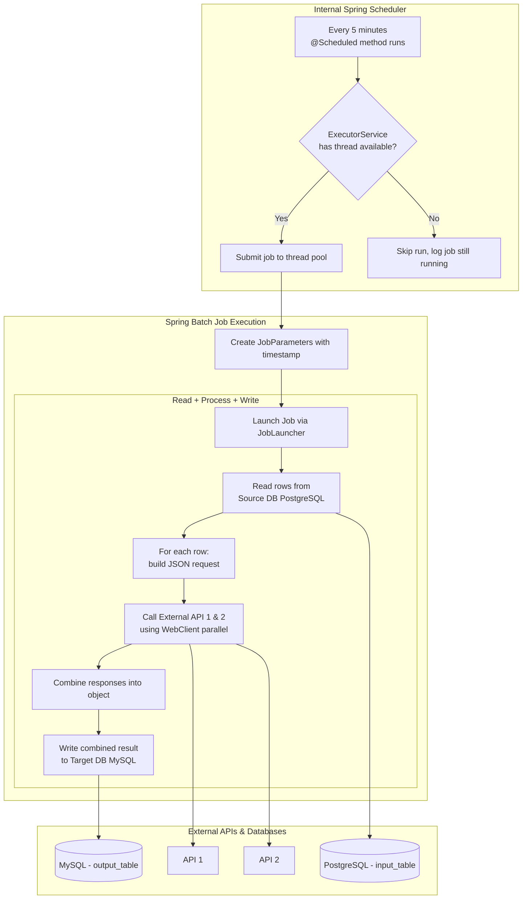

```mermaid

flowchart TD
    subgraph Scheduler [Internal Spring Scheduler]
        A1[Every 5 minutes<br/>@Scheduled method runs] --> A2{ExecutorService<br/>has thread available?}
        A2 -- Yes --> A3[Submit job to thread pool]
        A2 -- No --> A4[Skip run, log job still running]
    end

    subgraph BatchJob [Spring Batch Job Execution]
        A3 --> B1[Create JobParameters with timestamp]
        B1 --> B2[Launch Job via JobLauncher]

        subgraph Step 1 [Read + Process + Write]
            B2 --> C1[Read rows from<br/>Source DB PostgreSQL]
            C1 --> C2[For each row:<br/>build JSON request]
            C2 --> C3[Call External API 1 & 2<br/>using WebClient parallel]
            C3 --> C4[Combine responses into object]
            C4 --> C5[Write combined result<br/>to Target DB MySQL]
        end
    end

    subgraph ExternalSystems [External APIs & Databases]
        C3 --> D1[API 1]
        C3 --> D2[API 2]
        C1 --> E1[(PostgreSQL - input_table)]
        C5 --> E2[(MySQL - output_table)]
    end
```